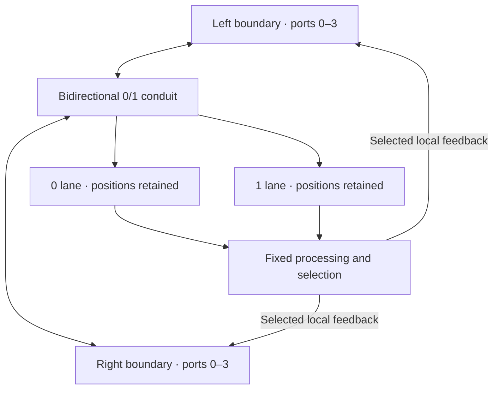

<!-- SPDX-License-Identifier: CC-BY-NC-ND-4.0 -->
<!-- Copyright 2026 Ingolf Lohmann. -->

# QIK-VRT Canonical Codec V1

Ingolf Lohmann authorizes a versioned lossless codec for static data and streams
as part of the QIK-VRT personal Digital Twin architecture. This implementation
combines the fixed standpoint, canonical snapshot and compression transport
around arbitrary bytes. The single normative machine contract is
`policy/QIKVRT_CODEC_CONTRACT_V1.json`; implementation: `src/qikvrt_codec.py`.

During implementation, PR #424 materialized the previously absent 400-byte
standpoint and canonical set serializer. This successor binds exactly that
candidate, `def7a93e7ae36426bebaf7b82519b670025f8f42`, and delegates snapshots
and element identities to `src/qikvrt_standpoint_codex.py`. PR #425 carries the
combined change against Main, preserving both drafts' ancestry and provenance.
Exact-head checks and responsible review apply to the consolidated candidate;
predecessor checks do not transfer.

## Standpoint and identity reuse

The exact 400-byte V1 image is
`canonical/QIKVRT_STANDPOINT_SIGNATURE_V1.bin`, SHA-256
`27a84a7e19e1b46f50d3a855b87da65f5fe07b806575b0d15ca0587b7cab5792`.
Its field semantics, descriptor hash, zero padding, stable labels,
content identities and canonical snapshot layout are authoritative in
`policy/QIKVRT_CODEC_CONTRACT_V1.json#/standpoint`.
`policy/QIKVRT_STANDPOINT_CODEX_V1.json` is an exact, nonnormative compatibility
projection of that fragment; tests reject drift. The human standpoint chapter
is `spec/QIKVRT_STANDPOINT_CODEX_V1.md`. These bytes are a first materialized review
candidate, not a recovered historical signature or an already reviewed release.

Every canonical element carries the exact same signature, a caller-assigned
32-byte stable label and a domain-separated SHA-256 content identity. A payload
change preserves the label and changes the content identity. The existing
codec rejects duplicate labels and identities, foreign/rehashed signatures,
noncanonical order, malformed lengths and unsupported versions. The compression
adapter introduces no second element representation or snapshot byte layout.

`encode_snapshot` calls the existing `serialize`, then compresses its exact
bytes with the bound signature. `decode_snapshot` first verifies complete
transport with that signature, then calls the existing `deserialize`. Its
output limit is the existing `Limits.max_snapshot_bytes`. A valid transport
hash does not legitimize a foreign standpoint or noncanonical snapshot.

Every new container, including arbitrary byte transport, uses the same fixed
standpoint. Python and CLI defaults select it; an explicitly supplied signature
must match it byte-for-byte. A foreign or correctly rehashed alternative fails
before encoding writes output. No codec-generated random nonce enters element
identity or snapshots; stable IDs are assigned and persisted by the caller.

Earlier generic-seed V1 transport remains readable only with explicit
`allow_legacy_seed=True` and an externally expected exact 400-byte seed.
The decoder never treats the input header as its own seed authority. The stream
receipt marks a foreign seed with `canonical_standpoint=False`; legacy decoding
retains all hash, framing and resource guards. This compatibility mode has no
encoder, snapshot adapter or implicit migration. `decode_snapshot` always
requires the canonical standpoint. Transport versioning remains separate from
standpoint/snapshot versioning. No marker or unkeyed
hash authenticates a natural person, authorizes execution or attests a physical
effect. SHA-256 bindings rely on its usual collision-resistance assumptions.

## Compression container

A 416-byte big-endian header binds magic, version, block size and fixed standpoint.
Bounded independent blocks bind method, raw/stored lengths and raw SHA-256.
A 49-byte END footer binds all exact wire bytes, block count and total raw bytes.
Raw fallback prevents compression-induced payload expansion. Complete framing
adds at most `465 + 41 * ceil(input_bytes / block_bytes)` bytes. Empty input has
zero blocks; only the last data block may be shorter than the configured size.
Unknown versions, flags, methods, malformed lengths, unfinished/concatenated
zlib streams, corruption, exceeded budgets and trailing bytes fail closed.

For every successfully encoded finite byte string x,
`decode(encode(x)) == x`, within the explicit
consumer budget. There is no normalization, text conversion or platform-specific
representation of arbitrary input bytes. For every canonical element set E,
`serialize(decode_snapshot(encode_snapshot(E))) == serialize(E)` byte-for-byte.

Compression profiles and zlib versions can produce different valid compressed
bitstreams. Canonical snapshot byte identity is independent of this storage
choice. When a wire hash matters, preserve the exact container. Future versions
must document their own layouts and explicitly retain old decoding support;
unknown versions are never guessed.

## Time and space profiles

| Profile | Compression trial | Purpose |
| --- | --- | --- |
| `raw` | None | Lowest compression work; bounded framing overhead |
| `fast` | zlib level 1, with distributed sampling | Prefer throughput; sampling may miss compressible regions |
| `balanced` (default) | Full block, zlib level 6 | Balanced compression without sampling shortcuts |
| `compact` | Full block, zlib level 9 | Prefer space within this algorithm and block layout |

Only `fast` samples. Four distributed 2048-byte samples are compressed at level
1 for blocks of at least 65536 bytes. A sample ratio of at least 0.98 selects RAW
without a full compression trial. The benchmark includes an adversarial sample
layout exposing the space tradeoff; tests require `balanced` and `compact` to
compress those data fully. The framed full-trial baseline uses the same seed,
profile, block size and SHA-256 gates, with sampling disabled. There was no
historical executable QIKVRT arbitrary-byte compressor on observed Main.

No profile is asserted to be fastest or smallest for every input or environment.
Lossless compression cannot shorten every possible finite input: injectivity
and the number of shorter bit strings exclude that claim. Benchmark results are
bound to actual source digests, seed, workload, runtime and trial conditions.

## Streaming and acceptance

`encode_stream` and `decode_stream` use default 256 KiB blocks, at most 16 MiB.
Auxiliary space is O(block size), independent of total stream size. Each zlib
result is capped at its declared length plus one byte before validation. Short
blocking reads/writes work; nonblocking None and zero-progress writes fail
closed. V1 declares unsigned 64-bit byte/block counters. The static API allocates
returned bytes and defaults to a 256 MiB decode budget; callers can change it.
Canonical snapshot budgets remain those of the existing codex's `Limits`.

Input may be produced incrementally while it and resources remain available.
Complete-container acceptance requires a verified END footer. An unclosed stream
is never reported as a completed finite container. `decode_stream` verifies
blocks before writing, but a late footer failure may follow already-written
blocks. Callers stage output when atomic acceptance is required. The CLI always
stages beside the destination and replaces it only after complete validation.

## Use and reproduce

```python
from src.qikvrt_standpoint_codex import Element, QIKVRT_SIGNATURE, serialize
from src.qikvrt_codec import encode, decode, encode_snapshot, decode_snapshot

wire = encode(payload, profile="balanced")
assert decode(wire) == payload
# Caller assigns and persists a distinct 32-byte label for each logical element.
elements = [Element(stable_id=stable_label, payload=payload)]
compressed = encode_snapshot(elements, profile="compact")
assert serialize(decode_snapshot(compressed)) == serialize(elements)
```

```sh
python3 -B -m src.qikvrt_codec encode input.bin output.qikvrt
python3 -B -m src.qikvrt_codec decode output.qikvrt restored.bin
make codec-test standpoint-codex-test
python3 -B tools/qikvrt_codec_benchmark.py --repeats 7 --output /tmp/codec-benchmark.json
```

For an earlier generic-seed transport only:

```sh
python3 -B -m src.qikvrt_codec decode historical.qikvrt restored.bin --allow-legacy-seed --signature-file externally-preserved-seed.bin
```

`--allow-legacy-seed` is decode-only and requires the explicit signature file.
It is rejected for encoding. Existing generic fixtures and benchmarks remain
historical evidence; they are not rewritten as canonical standpoint evidence.

The wire format has no operating-system or CPU layout dependency. Its reference
runtime uses Python's standard-library byte I/O, SHA-256 and RFC 1950/RFC 1951
zlib. Linux measurements establish the observed runtime only. Windows, macOS,
Docker/cloud delivery and future runtimes retain separate acceptance obligations.

## Digital Twin and effect boundary

Existing REST state/receipt bytes can be transported losslessly, without granting
execution authority over their contents. Related contract:
`policy/QIKVRT_DIGITAL_TWIN_REST_CONTRACT_V1.json`. Its absent Siemens reference
module and the separate formatting-sensitive promotion test remain owned by
PR #422. The feedback successor preserves the consolidated repair PR #436
alongside the exact codec PR #425 history; it does not overwrite their branches.

Ingolf Lohmann asserts that QIKAVRT/QIKVRT was developed, tested and used as a
personal Digital Twin for fully autonomous complex workflows, and asserts its
reality correspondence and REST/meta-transistor architecture. These owner
assertions remain attributed separately from this codec's verification scope. Codec tests
establish neither every autonomous human role nor FPGA operation, Siemens Horizon
tenant integration, a personal-browser release, scientific consensus or perpetual
future compatibility. Existing capability, rights, provenance and effect
boundaries remain in force. Encoding, compression, tests and transport alone
never establish `EFFECT_ACK_DONE` or authorize release/deployment/publication.

## Meta-transistor by bounded local feedback

Ingolf Lohmann's instruction of 2026-10-01 adds feedback to the bidirectional
transputer. The following diagram corrects both external arrow directions.
The four selected ports exist at each boundary; frame direction identifies
which boundary receives the next local input.



The implementation extends `src/qikvrt_codec.py`, with no second codec,
container format, workflow, repository writer or permit issuer. `BitFrame`
binds version, direction, boundary port, sequence, logical tick, hop, parent
digest and exact payload. It accepts byte-aligned finite frames; arbitrary
sub-byte lengths and physical clock measurements are outside this adapter.
`split_bit_lanes` routes zeros upward and ones downward as complementary packed
position masks, MSB first. `join_bit_lanes` requires complete disjoint masks.
It reconstructs exact input order; zero/one counts alone cannot do so.

An immutable `FeedbackPolicy` fixes one chain: identity, existing codec encode,
or existing codec decode. Four disjoint byte ranges select boundary ports.
Empty selection gives no feedback, a proper subset gives partial feedback,
and a partition gives complete feedback. Original input remains available.
Decode verifies the entire archive before returning any feedback selection.
Input/output budgets, closed operation names and a finite hop budget bound
local work. Encode uses a conservative worst-case bound before allocating its
container; a potentially fitting compressed result can consequently be refused.

`feedback_step` is a pure trigger. `local_refeed` verifies the step against the
same policy, binds its parent and selected port, and requires an advancing
sequence and logical tick before constructing the next frame. The caller
explicitly triggers each subsequent step. There is no automatic recursive loop.
Multiple independent frames, both directions and long streams require caller-
owned scheduling, durable replay/ordering journals and backpressure. This
adapter does not implement those services or authenticate incoming frames.

Every step invokes the existing Effect Acknowledgement evaluator with its exact
frame/policy/output/port binding. Its receipt has `ordinary_release=false` and
cannot self-authorize a repository effect. The 400-byte standpoint remains
byte-identical; it describes the existing serialization identity, and does not
contain arbitrary payloads, the CI/CD pipeline or this entire feedback policy.
The policy has a separate SHA-256 binding in the versioned codec contract.

```python
from src.qikvrt_codec import BitFrame, FeedbackPolicy, feedback_step, local_refeed

policy = FeedbackPolicy(routes=((0, 0, -1),), max_hops=2)
step = feedback_step(BitFrame("left-to-right", 0, 1, b"payload"), policy)
next_frame = local_refeed(step, policy, port=0, sequence=1, tick=2)
assert feedback_step(next_frame, policy).processed == b"payload"
assert step.effect_ack.ordinary_release is False
```

`make codec-test` includes the local feedback tests. A productive API-to-
repository feedback effect still requires admission by the existing Authority
executor and fresh native effect readback. These local tests do not establish
that effect, complete Mesh equality, CI/CD deployment, physical realization or
universal autonomous operation.
