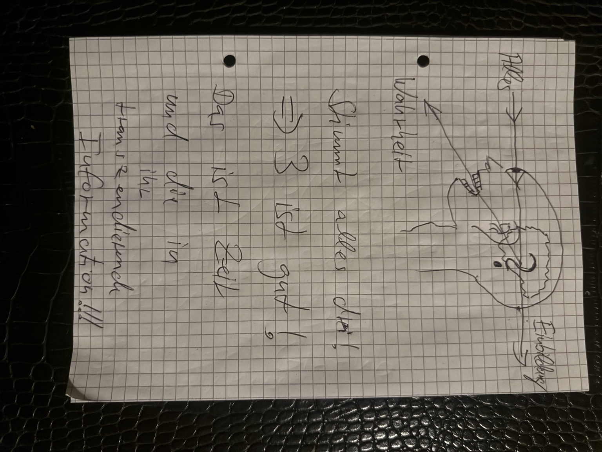
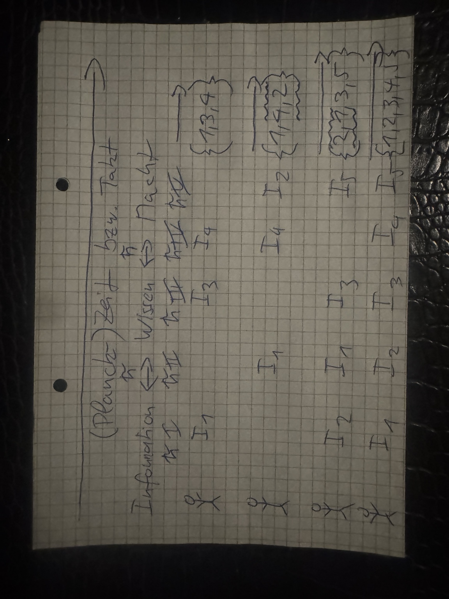
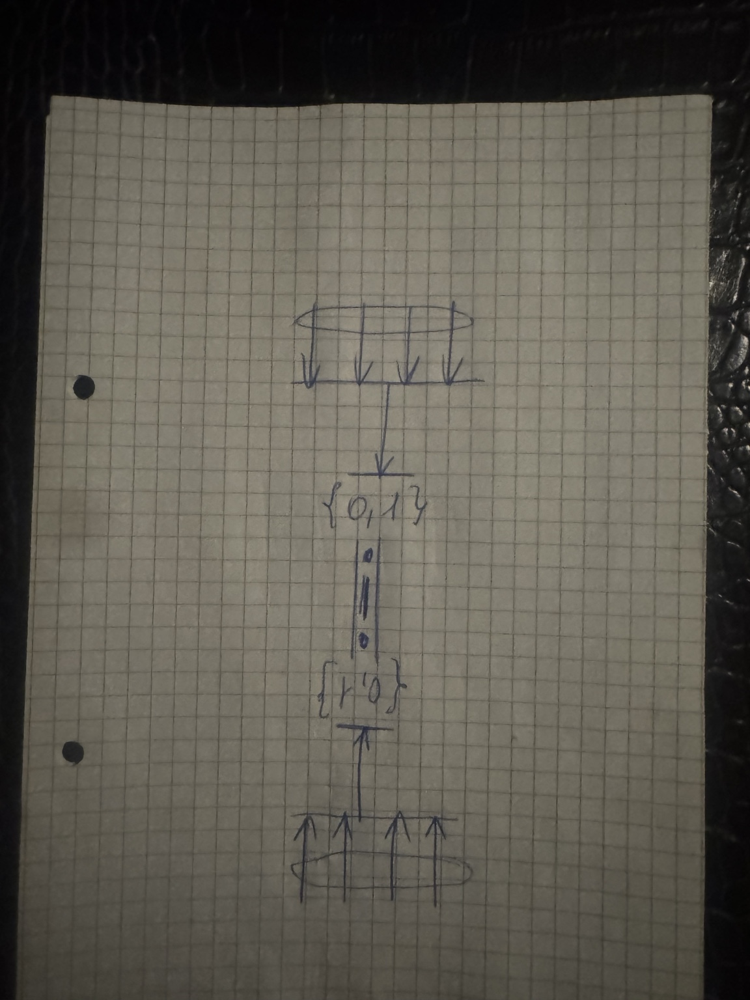
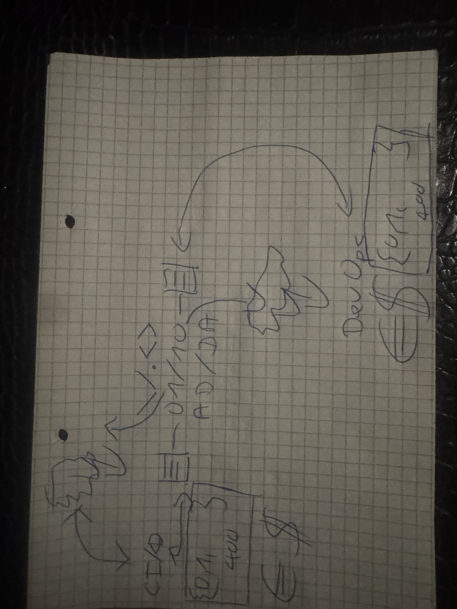
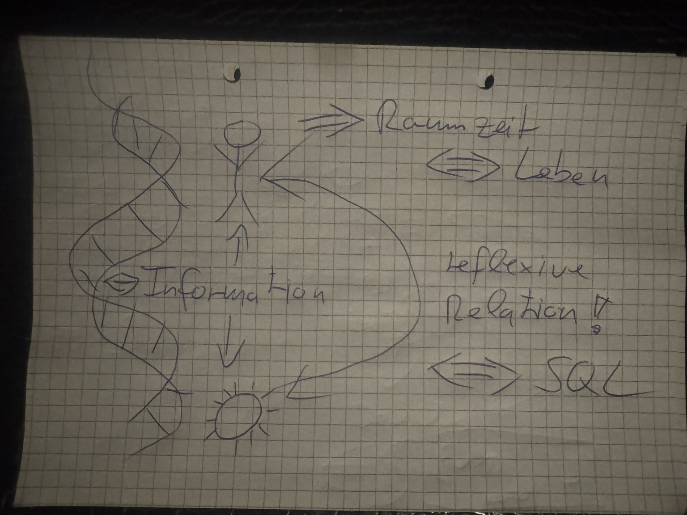
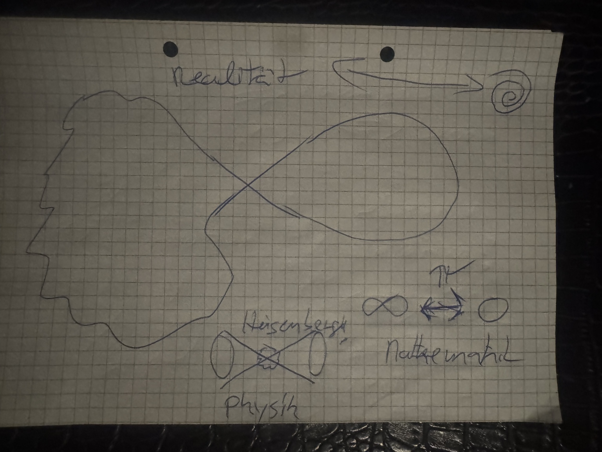

<!-- SPDX-License-Identifier: CC-BY-NC-ND-4.0; Copyright 2026 Ingolf Lohmann. -->

# QIK-VRT: handschriftliche Originalskizzen

Diese sechs handschriftlichen Originalskizzen stammen nach der ausdrücklichen Zuordnung ihres Urhebers von **Ingolf Lohmann**. Sie bilden einen zusammengehörigen Dokumentationssatz mit dem gemeinsamen Zweck, **die Wirkungsweise von QIK VRT universal anschlussfähig zu erläutern**.

Die Originaldateinamen und Bildbytes bleiben erhalten. Beschreibungen, Galerie, Metadaten und Prüfsummen sind separat erstellte Beiträge von OpenAI Codex.

## Herkunft und Entstehungsweg

Die handschriftlichen Blätter dokumentieren den menschlichen Ausgangsbeitrag zur Erklärung der QIK-VRT-Funktionsweise. Die sechs Fotografien wurden am 2. Oktober 2026 als zusammengehörige Quellen für das Archiv geprüft. Das Aufnahmedatum und das Datum der handschriftlichen Anfertigung sind damit nicht festgelegt.

Der nachvollziehbare Weg dieses Dokumentationssatzes lautet: handschriftliche Skizzen des Urhebers → bereitgestellte Originalfotografien → eindeutige Dateizuordnung und visuelle Prüfung → archivgebundene Beschreibungen und Prüfsummen → Repository-Kandidat → vorgesehene DOI-Archivierung. Die Zeichnungen werden als dokumentarische Primärquellen geführt. Technische Beweis-, Mess- und Laufzeitnachweise werden über ihre jeweiligen eigenen Quellen referenziert.

## Originale in stabiler Reihenfolge

| Nr. | Originaldateiname | Inhaltsbeschreibung |
|---|---|---|
| 01 | [IMG_1096.jpeg](originals/IMG_1096.jpeg) | Kopfprofil mit Pfeilen zwischen „Alles“, „Einbildung“ und „Wahrheit“; ergänzende Notizen zu Zeit und Information. |
| 02 | [IMG_1097.jpeg](originals/IMG_1097.jpeg) | Zeit-/Takt-Skizze mit „Information ↔ Wissen ↔ Macht“, I-Indizes und unterschiedlich angeordneten Zahlenmengen. |
| 03 | [IMG_1098.jpeg](originals/IMG_1098.jpeg) | Gegenläufige Pfeile bündeln sich auf eine zentrale Verbindung zwischen den binären Mengen {0,1} und {1,0}. |
| 04 | [IMG_1099.jpeg](originals/IMG_1099.jpeg) | Rückkopplungsskizze mit „AD/DA“, „CFO“, „DevOps“, binären Angaben, „400“ sowie Euro- und Dollarzeichen. |
| 05 | [IMG_1100.jpeg](originals/IMG_1100.jpeg) | Doppelhelix, Mensch und Sonne mit Informationspfeilen; Beschriftungen zu Raumzeit, Leben, reflexiver Relation und SQL. |
| 06 | [IMG_1101.jpeg](originals/IMG_1101.jpeg) | Kopfprofil mit Schleife und Spirale; Notizen zu Realität, Mathematik (∞, 0) sowie Physik und Heisenberg. |

### 01 · IMG_1096.jpeg

Kopfprofil mit Pfeilen zwischen „Alles“, „Einbildung“ und „Wahrheit“; ergänzende Notizen zu Zeit und Information.

### 02 · IMG_1097.jpeg

Zeit-/Takt-Skizze mit „Information ↔ Wissen ↔ Macht“, I-Indizes und unterschiedlich angeordneten Zahlenmengen.

### 03 · IMG_1098.jpeg

Gegenläufige Pfeile bündeln sich auf eine zentrale Verbindung zwischen den binären Mengen {0,1} und {1,0}.

### 04 · IMG_1099.jpeg

Rückkopplungsskizze mit „AD/DA“, „CFO“, „DevOps“, binären Angaben, „400“ sowie Euro- und Dollarzeichen.

### 05 · IMG_1100.jpeg

Doppelhelix, Mensch und Sonne mit Informationspfeilen; Beschriftungen zu Raumzeit, Leben, reflexiver Relation und SQL.

### 06 · IMG_1101.jpeg

Kopfprofil mit Schleife und Spirale; Notizen zu Realität, Mathematik (∞, 0) sowie Physik und Heisenberg.

## Nachweis und Veröffentlichung

- [Archivmanifest](ARCHIVE_MANIFEST.json): Quellenkennungen, Byteumfang, SHA-256 und Git-Blob-Identität.
- [Galerie](index.html): gemeinsame visuelle Darstellung aller sechs Originale.
- [Prüfsummen](SHA256SUMS): Dateiidentität des Dokumentationssatzes.
- [Anspruchsdisposition](CLAIM_MATRIX.json): quellengebundene Beschreibung und interpretative Lesart.
- [Veröffentlichungsstand](ORIGIN_AND_PUBLICATION_STATUS.json): getrennte Zielzustände für Repository und externe Kanäle.

Zenodo ist für die zitierfähige Archivierung vorgesehen. In diesem Kandidaten ist noch kein Zenodo-Upload, keine DOI und keine IETF-, Wikipedia- oder arXiv-Veröffentlichung nachgewiesen. Nach der DOI-Veröffentlichung kann die Quelle in einen passenden IETF-Erklärungsabschnitt und in einen arXiv-Begleitdateisatz aufgenommen werden. Wikipedia bleibt ein späterer, eigenständig zu prüfender enzyklopädischer Veröffentlichungsschritt.

Copyright 2026 Ingolf Lohmann. Lizenz: CC-BY-NC-ND-4.0 nach der bestehenden QIK-VRT-Dokumentationsregel. Kommerzielle Rechte werden durch diesen Archivierungsvorgang nicht zusätzlich eingeräumt.
